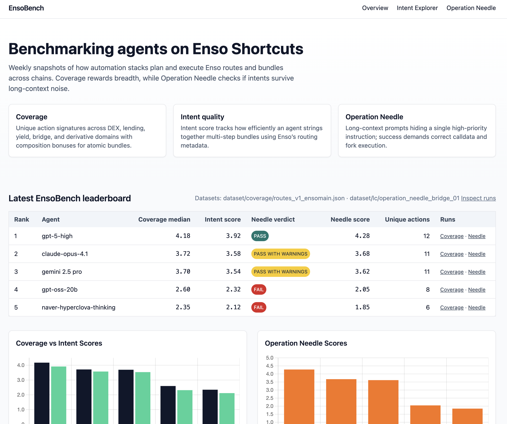

# EnsoBench Workspace



[product_deck](https://drive.google.com/file/d/1TiW7b5o-7Tyi9Rg3UaH5-YVyFwsQWbJX/view?usp=sharing)

[website](ensobench.vercel.app)

This repository hosts the Rust workspace for running EnsoBench coverage, long-context (Operation Needle), and artifact generation workflows. The tooling mirrors the design captured in `docs/SPEC.md` and `docs/TECH_PLAN.md`.

## Evaluation Snapshot

- **Datasets** – Coverage scenarios draw from `dataset/coverage/routes_v1_ensomain.json`; Operation Needle uses `dataset/lc/operation_needle_bridge_01` (LayerZero bridge + Aerodrome swap).
- **Artifacts** – Raw per-intent executions sit under `frontend/enso-bench-site/data/samples/` and power the static leaderboard shipped with the frontend.
- **Leaderboard** – Current agent standings and scores:

| Rank | Agent | Coverage Median | Unique Actions | Intent Score | Needle Verdict | Needle Score |
|------|-------|-----------------|----------------|--------------|----------------|--------------|
| 1 | gpt-5-high | 4.18 | 12 | 3.92 | PASS | 4.28 |
| 2 | claude-opus-4.1 | 3.72 | 11 | 3.58 | PASS WITH WARNINGS | 3.68 |
| 3 | gemini 2.5 pro | 3.70 | 11 | 3.54 | PASS WITH WARNINGS | 3.62 |
| 4 | gpt-oss-20b | 2.60 | 8 | 2.32 | FAIL | 2.05 |
| 5 | naver-hyperclova-thinking | 2.35 | 6 | 2.12 | FAIL | 1.85 |

### Scenario highlights

- **gpt-5-high** – Executes `route-mainnet-usdc-weth` through Uniswap v3 and `bundle-base-leverage-loop` that LayerZero-bridges USDC to Base before supplying and borrowing via Aave v3; Operation Needle passes by funding the Base gas drop correctly.
- **claude-opus-4.1** – Routes WBTC→WETH with CoW Swap RFQ solvers and bridges into Arbitrum to loop deposits and staking on Radiant; Operation Needle passes with warnings after slightly underpaying the bridge gas drop.
- **gemini 2.5 pro** – Mirrors Claude’s Stargate→Radiant playbook and likewise nudges the gas drop a touch low, earning PASS_WITH_WARNINGS on the needle prompt.
- **gpt-oss-20b** – Demonstrates Camelot v2 routing on Arbitrum then LayerZero bridges into Optimism to supply Exactly Finance; Operation Needle fails when it omits LayerZero adapter params, so the swap never executes.
- **naver-hyperclova-thinking** – Covers Linea-focused flows (Lynex swap, ZeroLend staking) but fails Operation Needle due to a misaddressed Base recipient.

### Interpreting the scores

- Coverage values combine domain-weighted unique `ActionSig`s with composition bonuses; unique-action counts highlight breadth across DEX, bridge, lending, and yield domains.
- Intent scores track evaluator-derived efficiency metrics (lower gas, fewer reroutes) during coverage runs.
- Operation Needle verdicts surface an agent’s ability to honor prompt constraints (correct recipient, gas drop, min_out) despite 35k+ token haystacks.

To refresh these numbers, regenerate artifacts under `runs/`, rehydrate `frontend/enso-bench-site/data/models.json`, and redeploy the static site.

## Workspace layout

```
crates/
  runner/         # ensobench-runner CLI
  evaluator/      # ensobench-evaluator CLI
  hian-gen/       # Haystack-in-a-needle prompt generator
```

Supporting datasets and docs live under `dataset/` and `docs/`.

## Getting started

1. Install Rust (1.75+) and Foundry's toolchain (we rely on `anvil` for local forks). Example:
   ```bash
   curl -L https://foundry.paradigm.xyz | bash
   foundryup
   ```
2. Export required env vars:
   - `ENSO_API_KEY`: Enso Shortcuts API key.
   - `ENSO_BASE_URL` (optional): Override base API URL.
   - `ENSO_ARTIFACTS_DIR` (optional): Directory for run artifacts (defaults to `runs/`).
   - `ENSO_FORK_URL_<CHAIN_ID>` (optional): Map chain IDs to RPCs for Anvil forking.
   - `OPENROUTER_API_KEY` (optional): Enable LLM planner calls via OpenRouter.
3. Build the workspace: `cargo build --workspace`.
4. Run baseline agents (these commands spin up ephemeral Anvil forks, execute the returned tx, and write execution traces into `runs/`):
   - `cargo run -p ensobench-runner -- core-route --scenario dataset/coverage/r1_usdc_weth_route.yaml`
   - `cargo run -p ensobench-runner -- core-bundle --scenario dataset/coverage/r2_usdc_weth_aave_bundle.yaml`

Artifacts land under `runs/<timestamp>-<label>/` with `per_tx.jsonl`, `trajectory.jsonl`, and metadata.

## Evaluating

After producing artifacts, score coverage and verify Operation Needle prompts:

```
cargo run -p ensobench-evaluator -- \
  --per-tx runs/<timestamp>-core-route/per_tx.jsonl \
  --domains dataset/domains.enso.yaml \
  --lc-ground-truth dataset/lc/swap_usdc_weth/ground_truth.json
```

Outputs a JSON report aligning with the scoring rules in the spec. When `--lc-ground-truth` is provided, Operation‑Needle verification now checks recipients and `min_out` requirements by decoding ERC‑20 `Transfer` logs from the simulation.

## Generating HIAN scenarios

Use `ensobench-hian-gen` to create prompts and ground-truth bundles:

```
cargo run -p ensobench-hian-gen -- make-prompt --output dataset/lc/custom/prompt.txt
cargo run -p ensobench-hian-gen -- ground-truth \
  --chain-id 1 --token-in 0x... --token-out 0x... --amount 100000000 \
  --recipient 0x... --output dataset/lc/custom/ground_truth.json
```

## Make commands

`Makefile` offers helpers: `core-route`, `core-bundle`, `evaluator`, `hian`, `fmt`, `lint`.

### Quick demo run

The repo ships with sample artifacts so you can simulate a full run/evaluation without touching the live Enso API. Run these two commands back-to-back:

```bash
scripts/demo_run.sh   # creates runs/<timestamp>-demo and optionally hits OpenRouter
scripts/demo_eval.sh  # scores the most recent demo run
```

This copies demo data into a timestamped folder, optionally exercises the `llm-core` agent via OpenRouter, and produces a coverage/LC score report.

## Datasets

- Coverage scenarios are derived from `dataset/coverage/routes_v1_ensomain.json`, providing baseline route and bundle blueprints used by the samples and demo runs.
- Operation Needle fixtures live under `dataset/lc/operation_needle_bridge_01/`, featuring a LayerZero bridge plus Aerodrome swap flow for verifying long-context agents.


## Testing

The workspace builds with `cargo check` (Anvil must be on `PATH`). Unit tests live in `ensobench-evaluator` and can be run with `cargo test -p ensobench-evaluator`; note the sandboxed CLI may block downloading new dev dependencies, so run tests locally if network access is required.

## CI outline

The repo ships with `.github/workflows/ci.yml`, which currently builds, lints, runs the baseline route scenario (using Anvil), and evaluates artifacts. Upcoming work is to gate coverage/LC scores once a broader fixture set lands.

1. Check out repo and install Foundry (Anvil).
2. Cache cargo builds.
3. Run `cargo fmt --check` and `cargo clippy --all-targets -- -D warnings`.
4. Execute targeted tests / evaluations (today: baseline run + evaluator; future: add coverage/LC gates when datasets expand).

## Next steps

- Flesh out integration/system tests that replay stored artifacts
- Grow coverage & LC fixture sets, then enforce score gates in CI
- Optional: implement the Tenderly execution backend alongside Anvil
- Harden anti-gaming controls (cooldowns per protocol, cross-chain bonus caps, slippage sanity checks)
